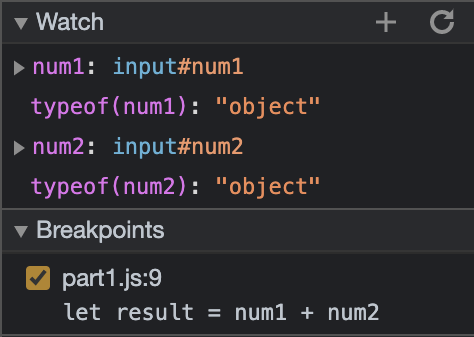
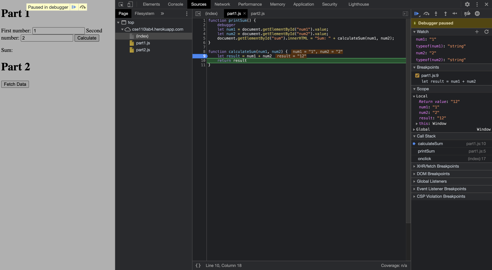
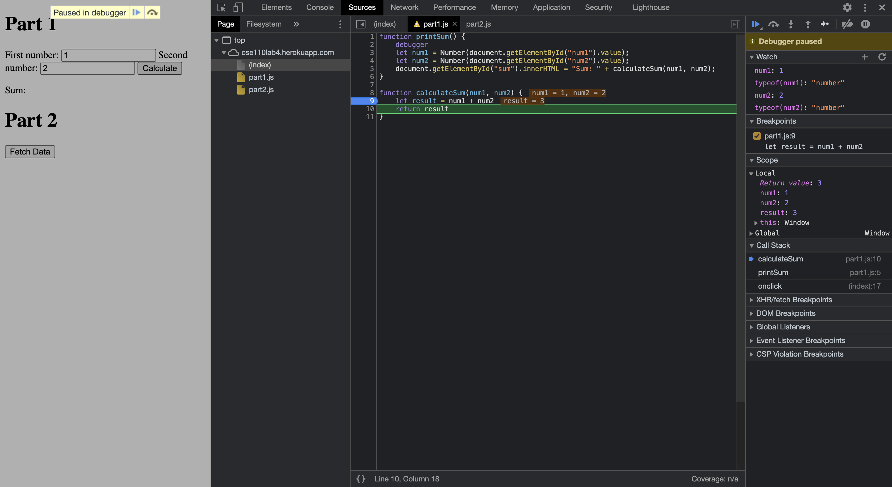
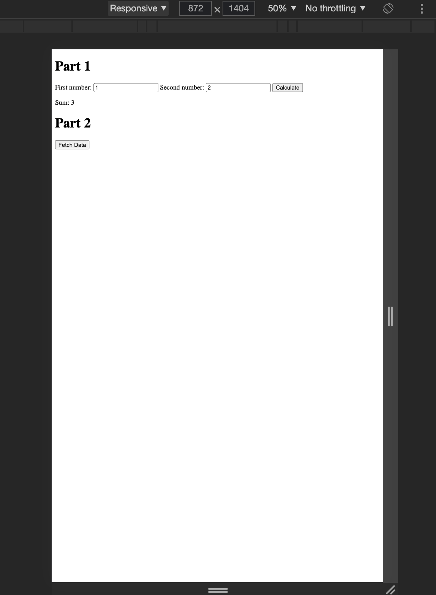

1. The bug in [Part 3 site]() is that values stored in `num1` and `num2` are of type `string`. Thus, performing the operation `num1 + num2` concatenates the two strings and stores the result in `result` which is then displayed on the page. 

To debug this code, I added some breakpoints and some watch variables as following: 

Let us walkthrough an example with the first number as `1` and second as `2`

From above, it is clear that the type of values stored in `num1` and `num2` is `string`. Thus, `num1 + num2` concatenates them and stores `"12"` in `result`

2. This could be fixed by converting the string inputs to `number` before storing them in `num1` and `num2` using the function `Number()`. 

| Debug Output | Final Output |
|----|----|
|  |  |

As shown above, converting the strings to numbers fixes our script and we get the correct sum.

3. Name: citylots.json
4. `part2.js` initiated the download
5. `citylots.json` is 11.7 MB
6. 2.68s
7. User Agent: Mozilla/5.0 (Macintosh; Intel Mac OS X 10_15_7) AppleWebKit/537.36 (KHTML, like Gecko) Chrome/90.0.4430.85 Safari/537.36
8. Server: Apache
9. Last-Modified: Tue, 26 Jan 2021 22:14:13 GMT
10. Content-Type: application/json
11. `fetchData()` in `part2.js` made the request